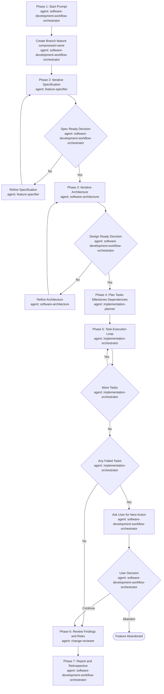
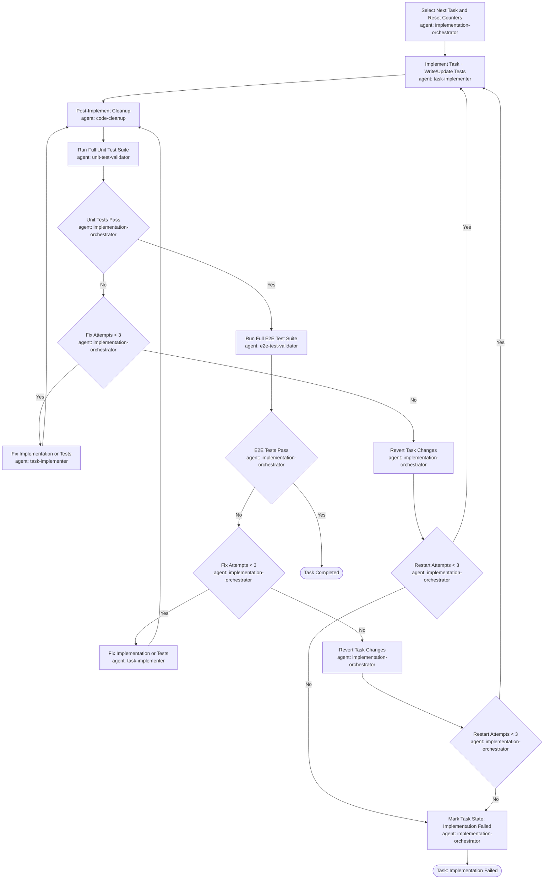

# Software Development Workflow Framework Spec

## Status

Draft v0.1

This document is a working specification for a GitHub Copilot asset framework that supports end-to-end software development work.

## Purpose

Define a reusable Copilot-based framework that can guide software work from intake through delivery using repository-hosted assets under `.github/`.

The framework should help with:
- understanding a software feature or product before editing code
- planning implementation in explicit phases
- executing changes with validation
- improving and organizing code after implementation
- producing clear reviewable outputs
- preserving enough structure to be repeatable without becoming rigid

## Goals

- Provide a primary workflow agent for delivering software features or products.
- Break the workflow into explicit phases with entry and exit criteria.
- Use the right asset type for each concern:
	- agents for end-to-end orchestration
	- prompts for reusable task templates
	- instructions for durable repository conventions
- Support both greenfield work and changes in existing repositories.
- Encourage validation, minimal diffs, and clear reporting.
- Prioritize quality and maintainability over delivery speed.

## Non-Goals

- Replacing repository-specific coding standards.
- Defining language-specific implementation rules in this spec.
- Automating PR creation or CI/CD unless later added explicitly.
- Forcing one fixed SDLC across every repository.

## Design Principles

- Be opinionated about workflow, not about tech stack.
- Optimize for correctness and maintainability over velocity.
- All implementation must proceed in small, reviewable iterations. Large speculative changes are not permitted.
- Require context gathering before implementation.
- Separate orchestration knowledge from domain-specific knowledge.
- Prefer artifacts that are composable across repositories.
- Keep human approval points visible for ambiguous or high-risk work.

## Proposed Framework Shape

### 1. Core Agents

Create a multi-agent workflow for software delivery rather than relying on a single generalist agent.

Proposed agent set:
- `software-development-workflow-orchestrator.agent.md`
	- coordinates all agents across phases, manages iteration over planned tasks, and controls handoffs
- `feature-specifier.agent.md`
	- turns a rough request into a clear software feature or product definition with scope, constraints, assumptions, and acceptance criteria
- `software-architecture.agent.md`
	- transforms an approved feature specification into an implementable technical design that defines components, modules, deployments, interactions, APIs, and boundaries
- `implementation-planner.agent.md`
	- takes an approved specification and architecture design and converts them into implementation tasks with explicit steps, milestones, and dependencies
- `implementation-orchestrator.agent.md`
	- executes the implementation plan by orchestrating task-level implementation and cleanup cycles
- `task-implementer.agent.md`
	- implements one planned task at a time; tasks must be minimal and granular; writes or updates all unit tests, and identifies and updates any E2E tests impacted by this task
- `code-cleanup.agent.md`
	- performs post-implementation cleanup to reduce duplication, improve structure, and apply coding best practices
- `unit-test-validator.agent.md`
	- verifies that unit tests for the completed task were added or updated by the implementer, then executes the full unit test suite and reports results; does not write or fix tests
- `e2e-test-validator.agent.md`
	- verifies that E2E tests impacted by the completed task were updated by the implementer, then executes the full E2E test suite and reports results; does not write or fix tests
- `change-reviewer.agent.md`
	- performs a focused review for correctness, regression risk, and validation gaps before closeout

Agent responsibilities:
- the software development workflow orchestrator owns phase transitions, approval gates, and iteration control
- the feature specifier owns clarification and feature framing
- the software architecture agent owns iterative technical design and design trade-off documentation
- the planner owns conversion of approved spec and design into executable tasks, milestones, and dependencies
- the implementation orchestrator owns task-by-task delivery sequencing
- the task implementer owns focused single-task code changes
- the code cleanup agent owns post-task maintainability improvements
- the unit test validator owns per-task unit test coverage verification and full unit test suite execution
- the e2e test validator owns per-task E2E test coverage verification and full E2E test suite execution
- the reviewer owns final quality scrutiny and residual risk assessment

### 2. Supporting Prompts

Prompts are human-side templates. Unlike agents, which run autonomously, prompts are referenced manually to give Copilot a consistent structured starting point for a conversation. They serve two purposes in this framework:
- entry points to individual workflow phases without triggering the full orchestrated pipeline
- reusable templates applicable to work that happened outside the framework, such as reviewing an external change

Proposed initial prompts:

- `start-feature-or-product.prompt.md`
	- mandatory entry prompt for starting a new feature or product flow in the framework
	- captures feature/product intent, scope boundaries, and initial constraints
	- triggers mandatory branch creation before the specification phase starts
	- complements `software-development-workflow-orchestrator.agent.md`

- `implementation-plan.prompt.md`
	- a template for requesting an implementation plan from an already-accepted specification
	- use when you have a clear spec and want to jump straight to planning without running the full orchestrated flow
	- complements `implementation-planner.agent.md`

- `review-and-validate.prompt.md`
	- a checklist-style template for triggering a focused code review and validation pass
	- use when reviewing changes that happened outside the framework, such as an external PR or a manual patch
	- complements `change-reviewer.agent.md` but can be used independently

- `retrospective.prompt.md`
	- a structured post-feature reflection template for capturing what worked, what failed, and what should be improved
	- use at the end of a completed feature or after a significant incident
	- produces the same output as Phase 7 but can be invoked manually at any time

### 3. Supporting Instructions

Create instructions only where durable auto-applied guidance is valuable.

Candidate instruction files:
- `workflow-spec-writing.instructions.md`
	- applies to `specs/**/*.spec.md`
	- keeps specs focused on goals, scope, decisions, and acceptance criteria
- `copilot-asset-authoring.instructions.md`
	- applies to `.github/**/*.{agent,instructions,prompt}.md` as appropriate if supported by glob strategy
	- keeps future workflow assets consistent

## Workflow Definition

The agent framework should follow these phases.

### Phase 1. Flow Start And Branch Setup

Inputs:
- user request
- attached files
- active workspace context
- `start-feature-or-product.prompt.md`

Required outputs:
- initial feature/product brief
- created branch name

Approval checkpoint:
- none for branch creation; branch creation is mandatory when workflow starts in a repository

Required actions:
- verify a git repository is initialized before any workflow action
- if invoked outside a git repository, stop immediately and report a blocking precondition failure
- create a branch using a compressed branch-safe name derived from the feature/product name
- branch naming format: `feature/<compressed-name>` where `<compressed-name>` is lowercase kebab-case, punctuation-stripped, and shortened to a practical length

Exit criteria:
- the branch is successfully created and the framework transitions to iterative specification

### Phase 2. Specification (Iterative)

Required actions:
- the `feature-specifier` develops the specification collaboratively with the user
- refine scope, assumptions, constraints, acceptance criteria, and edge cases over multiple iterations
- persist each iteration in repository state files

Required outputs:
- evolving feature/product specification
- unresolved specification questions list
- accepted specification snapshot persisted as feature-spec.md in shared state directory

Exit criteria:
- this phase ends only when the user explicitly states the specification is complete and ready

### Phase 3. Software Architecture (Iterative)

Required actions:
- the `software-architecture` agent transforms the approved specification into an implementation design
- define modules, components, interactions, API contracts, deployment implications, data flow, and operational constraints
- iterate with the user until design concerns are resolved
- persist each iteration in repository state files

Required outputs:
- architecture design document aligned with the approved specification
- documented trade-offs and rationale
- known design risks and mitigation notes persisted as architecture-design.md in shared state directory

Exit criteria:
- this phase ends only when the user explicitly states the design is ready

### Phase 4. Plan

Required actions:
- convert approved specification and architecture design into granular, minimal implementation tasks
- each task must be scoped to the smallest meaningful unit of change; large tasks must be split
- include explicit tasks for writing new E2E tests as separate planned items
- identify validation strategy before editing
- note assumptions and dependencies

Required outputs:
- ordered implementation tasks
- milestones and dependencies across steps
- validation steps
- expected deliverables
- persisted as task-list.md in shared state directory

Exit criteria:
- a minimal viable path to completion is defined

### Phase 5. Execute

Required actions:
- iterate through planned tasks one at a time; tasks must be minimal and granular
- for each task: implement, clean up, then run unit tests followed by E2E tests
- make focused changes aligned with the active task only
- avoid unrelated edits
- reuse existing patterns where possible
- update docs or specs if needed for completeness
- stop for user input if new ambiguity or materially increased risk appears during execution
- as part of every task, identify and update any E2E tests that are impacted by the change
- update task-list.md in the shared state directory after each task completes
- track per-task state transitions in task-list.md

Required outputs:
- code or asset changes
- any new supporting files justified by the task
- test-results.md updated per task attempt

Task iteration loop:
1. `implementation-orchestrator` selects the next planned task and resets counters:
   - `fix-attempts = 0` for the current implementation cycle
   - `restart-attempts = 0` for full task re-implementation cycles
2. `task-implementer` implements the task; writes or updates all unit tests; identifies and updates any impacted E2E tests.
3. `code-cleanup` runs immediately after implementation.
4. `unit-test-validator` executes the full unit test suite.
5. If any unit tests fail:
	- increment fix-attempts counter
	- if counter ≤ 3: `task-implementer` fixes implementation or tests; go back to step 3
	- if counter > 3: revert all task changes, increment `restart-attempts`, and restart the task from scratch at step 2 with `fix-attempts` reset
	- if `restart-attempts` >= 3: mark task state as `Implementation failed`
6. All unit tests pass → `e2e-test-validator` executes the full E2E test suite.
7. If any E2E tests fail:
	- increment fix-attempts counter
	- if counter ≤ 3: `task-implementer` fixes implementation or tests; go back to step 3
	- if counter > 3: revert all task changes, increment `restart-attempts`, and restart the task from scratch at step 2 with `fix-attempts` reset
	- if `restart-attempts` >= 3: mark task state as `Implementation failed`
8. If task state is `Implementation failed`:
	- if other tasks are implementable, continue with next task
	- if no other tasks are implementable, ask user for input on how to proceed
9. All unit and E2E tests pass → mark task state as `Completed`, update task-list.md and test-results.md, proceed to next task.

Exit criteria:
- all planned tasks are complete with unit and E2E test suites passing, or a concrete blocker has been proven

### Phase 6. Validate And Review

Required actions:
- run relevant lint and static checks when available and safe
- confirm acceptance criteria against the passing test suites
- perform an explicit review pass for correctness, regressions, and coverage gaps
- all test suites must be fully green before review proceeds; surface any remaining failures as blocking

Required outputs:
- lint and static analysis results
- confirmation that unit and E2E test suites are fully passing
- review findings or explicit no-finding result
- known limitations
- residual risks or untested paths
- persisted as review-report.md in shared state directory

Exit criteria:
- the framework can state what is verified and what remains uncertain

### Phase 7. Report And Retrospective

Required actions:
- summarize what changed
- reference important files
- call out any blockers, risks, or next actions
- capture a retrospective on what worked, what failed, and what should be improved; mandatory for every completed feature

Required outputs:
- feature-summary.md saved to shared state directory
- retrospective.md saved to shared state directory
- verification status
- next steps only when they are natural and concrete

## Process State Management (Mandatory)

All framework phases must persist process state in repository files.

Required rules:
- all process state lives under `memory/product/` in the repository root
- create `memory/product/` if it does not exist
- create a feature run directory named after the active branch
- each agent stores its own state in an agent-specific subdirectory under the feature run directory
- shared state used by multiple agents (for example task list status, phase status, and handoff pointers) is stored at the feature run directory root

Required structure (example):

```text
memory/
	product/
		feature-user-auth-hardening/
			shared/
				task-list.md
				phase-state.json
				handoff-state.json
			software-development-workflow-orchestrator/
			feature-specifier/
			software-architecture/
			implementation-planner/
			implementation-orchestrator/
			task-implementer/
			code-cleanup/
			unit-test-validator/
			e2e-test-validator/
			change-reviewer/
```

## Framework Artifacts

The framework produces the following mandatory artifact files per feature run. All artifacts are stored in `memory/product/<branch-name>/shared/`.

| Artifact | Filename | Produced In | Description |
|---|---|---|---|
| Feature Specification | `feature-spec.md` | Phase 2 | Approved feature or product specification |
| Architecture Design | `architecture-design.md` | Phase 3 | Technical design including components, APIs, and deployment |
| Implementation Task List | `task-list.md` | Phase 4, updated Phase 5 | Ordered task list with per-task completion status |
| Test Results | `test-results.md` | Phase 5 per task | Aggregated unit and E2E test results per task |
| Review Report | `review-report.md` | Phase 6 | Code review findings, verification status, and residual risks |
| Feature Summary | `feature-summary.md` | Phase 7 | Summary of what was delivered and files changed |
| Retrospective | `retrospective.md` | Phase 7 | What worked, what failed, and what to improve |

Format templates for these documents are defined in:
- `specs/software-development-workflow/feature-spec-format.md`
- `specs/software-development-workflow/architecture-doc-format.md`

## End-to-End Flow Diagram



### Phase 5: Task Execution Loop Diagram



## Asset Responsibilities

### Agent Responsibilities

The combined agent workflow should:
- preserve a clean handoff from specification to planning to iterative implementation and cleanup to review
- maintain disciplined progress updates across phases
- prefer action over prolonged discussion when the task is clear
- require user approval after task specification and again only when ambiguity or risk justifies it
- avoid duplicating responsibilities across agents
- treat maintainability cleanup as a first-class part of implementation, not an optional afterthought

### Prompt Responsibilities

Prompts should:
- provide reusable human-invoked templates
- support standard outputs for planning, review, or retrospection
- remain shorter and more tactical than agent definitions

### Instruction Responsibilities

Instructions should:
- encode durable rules that should auto-apply
- avoid carrying workflow logic that belongs in prompts or agents
- remain scoped to matching file patterns

## Deliverables

Proposed v1 deliverables:
- 10 core agents
- 4 reusable prompts
- 1 to 2 instruction files where auto-application is clearly useful
- 7 per-feature artifact files
- 2 document format templates
- this spec updated to reflect final naming and scope decisions

## Success Criteria

The framework is successful if it consistently causes the agent to:
- gather context before editing
- get the task clearly specified before planning or implementation
- plan before broad implementation
- make focused task-level changes instead of sprawling edits
- run post-task cleanup for organization and duplication control
- validate changes before claiming completion
- perform a review pass before completion
- communicate assumptions, blockers, and risks clearly

The framework should also work for:
- existing repository change work
- greenfield project setup and early architecture work

## Resolved Decisions

- v1 uses a multi-agent workflow rather than a single generalist agent
- v1 should support both existing repositories and greenfield work as first-class use cases
- user approval is required after the task is specified, and later only when ambiguity or risk justifies another pause
- code review is part of the core workflow
- spec and plan artifacts are part of the core workflow
- retrospective output is part of the core workflow
- task specification and implementation planning remain separate agent responsibilities
- software architecture is a dedicated agent phase between specification and planning
- quality and maintainability are prioritized over velocity
- an explicit code cleanup agent is part of the core execution loop
- implementation proceeds iteratively task by task with unit and E2E test suites running after every task; max 3 fix attempts per failure before revert and restart
- tasks must be minimal and granular; the implementation plan must include explicit tasks for new E2E tests
- the framework uses two test layers: unit tests and E2E tests; component tests are not a separate category in v1
- git hygiene automation such as commit message drafting and PR summaries is not part of v1
- retrospective is mandatory for every completed feature
- code cleanup runs after every implementation task without exception
- the framework generates seven mandatory artifact files per feature run stored in the shared state directory
- framework startup always creates a feature branch and assumes an initialized repository in flow descriptions
- implementation must stop with a blocking error if the workflow is invoked outside a git repository
- all phases persist state in `memory/product/<branch-name>/...` inside the repository

## Open Decisions

Open decisions for current and future revisions:

1. Define the full task-state model in `task-list.md`.
	- Required states likely include: `Not started`, `In progress`, `Blocked`, `Completed`, `Implementation failed`.
	- Define valid transitions, retry counters, revert markers, and ownership updates.
2. Finalize whether to keep long-form agent names in all diagrams and references, or adopt short aliases consistently.
3. Decide whether ADRs or formal test plans should be added as required artifacts in a future version.
4. Decide whether git/PR hygiene outputs belong in a future version.
